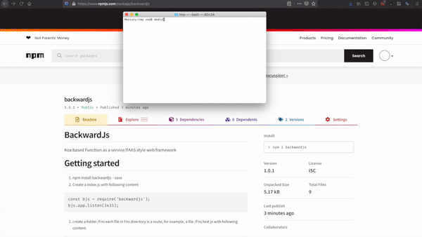

# BackwardJs
Koa based Function as a service/FAAS style web framework



# Getting started
1. `npm install backwardjs --save`

2. Create a index.js with following content 
```
const bjs = require('backwardjs');
bjs.app.listen(3433);
```

3. create a folder /Fns 
each file in Fns directory is a route, for example, a file /Fns/test.js with following content:
```
const test = async (ctx, next) => {
    ctx.body='test'
}
module.exports = { test };
```
will be available at localhost:3433/test

4. `node index.js`

# Dynamic routes
backwardJs has NextJs style dynamic routes.

for example, /Fns/api/todo/[id].js with following content:
```
const get = async (ctx, next) => {
    ctx.body = (ctx.params.id)
}

const post = async (ctx, next) => {
    ctx.body = (ctx.params.id)
}

const del = async (ctx, next) => {
    ctx.redirect('/')
}

module.exports = {
    '/api/todo/[id]': {
        method: 'GET',
        fn: get
    },
    '/api/todo/[id]_POST': {
        method: 'POST',
        route: '/api/todo/[id]',
        fn: post
    },
    '/api/todo/[id]_DEL': {
        method: 'DELETE',
        route: '/api/todo/[id]',
        fn: del
    }
};
```
matches and provisions params.id to ctx object
eg: http://localhost:3433/api/page/12 

you can optionally define the HTTP method, route url and function to execute in the module.exports object as shown in example above